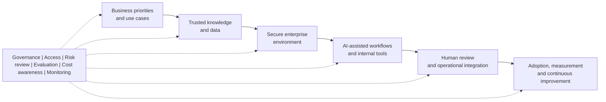

# Enterprise AI Enablement Playbook

A public-safe collection of practical patterns for moving enterprise AI from experimentation into governed, useful adoption.

The playbook is designed for business and technology teams that need to identify worthwhile use cases, prepare trusted knowledge, introduce human review, support users, and measure whether an AI-assisted workflow is ready to scale.

## Enterprise AI Enablement Pattern

The sequence is deliberate. Technology selection follows the business problem, information quality, risk boundary, and operating model rather than leading them.

## Public Portfolio Artefacts

- [AI Use Case Intake and Prioritisation](docs/AI_USE_CASE_INTAKE_AND_PRIORITISATION.md) - a reusable intake and decision template.
- [Enterprise AI Enablement Pattern](docs/ENTERPRISE_AI_ENABLEMENT_PATTERN.md) - a business-language architecture and operating model.
- [Pilot to Adoption Playbook](docs/PILOT_TO_ADOPTION_PLAYBOOK.md) - a controlled path from discovery to scale-up.
- [Fictional Service Operations Case](docs/FICTIONAL_SERVICE_OPERATIONS_CASE.md) - a worked example for an internal knowledge assistant.
- [Public Scope](PUBLIC_SCOPE.md) - the safety and evidence boundary for this repository.

## How To Use This Repository

1. Start with the intake template and define a real business problem.
2. Assess knowledge readiness, access, risk, and ownership.
3. Design the smallest useful pilot with explicit human review.
4. Agree success measures before implementation.
5. Review evidence, user feedback, operational fit, and cost before scaling.

## Public-Scope Statement

All scenarios in this repository are generic or fictional. They do not describe a client engagement, employer system, private implementation, or production result. No confidential data, credentials, private infrastructure, internal prompts, or proprietary architecture are included.

